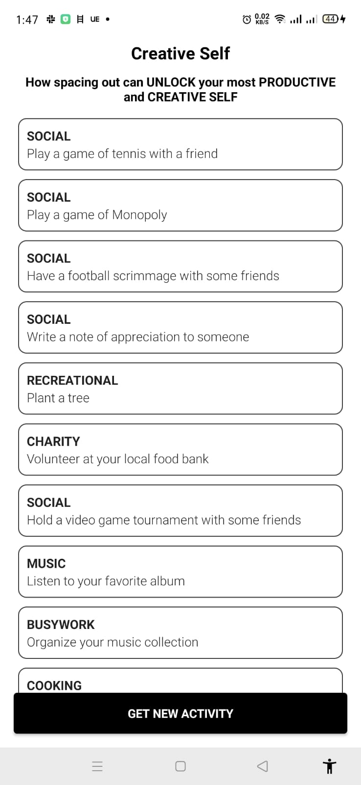
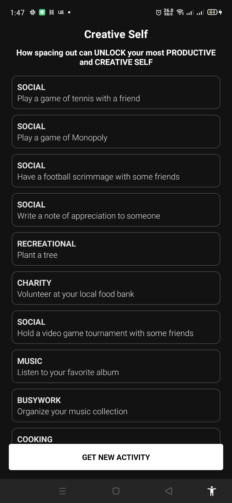

# BrilliantBoredom
Exploring personal time with personal activities that help in building relationship and the mind. This app consumes 

## Prerequisite
To run the project you should have the following tools

* Android Studio 4.0 or above
* Internet connection
* Retrofit
* Gson
* Architecture Components
* Dagger Hilt
* Room Database
* Coroutines
* Jetpack Compose
* MVVM and Clean architeture.

## Screenshots
|||
|:----:|:----:|
